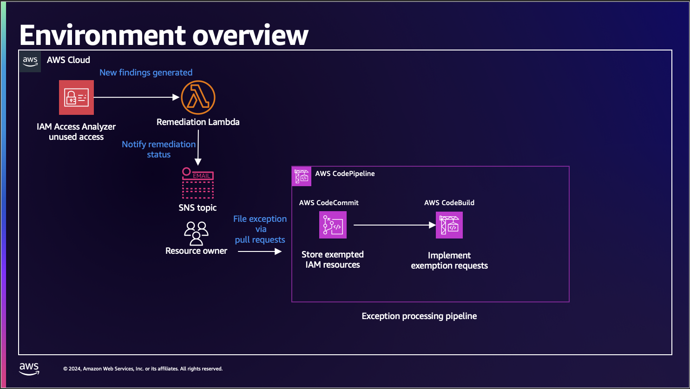
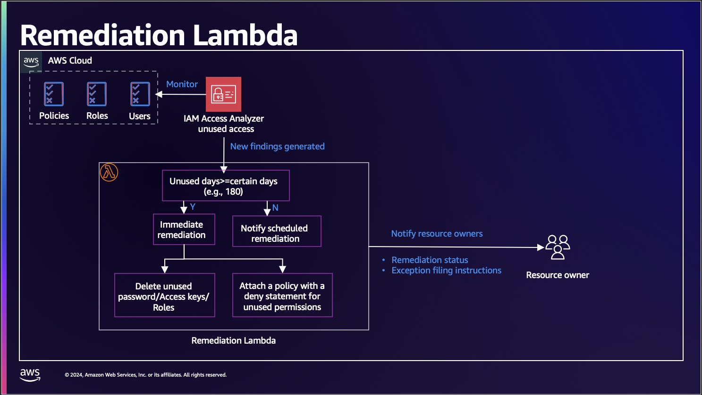
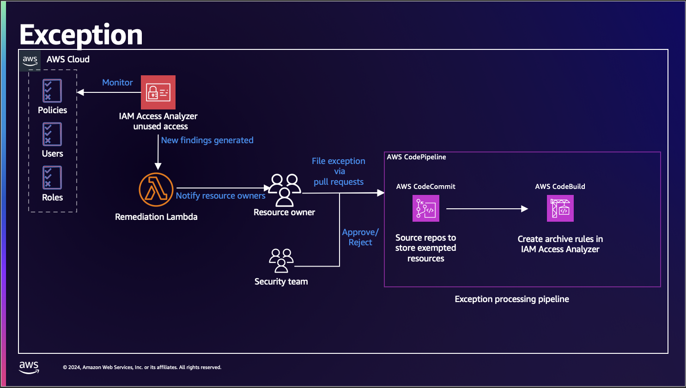

# Copyright Amazon.com, Inc. or its affiliates. All Rights Reserved.
# SPDX-License-Identifier: MIT-0

# Unleash the power of IAM Access Analyzer Unused Access

This project is part of the workshop [Unleash the power of IAM Access Analyzer Unused Access](https://catalog.workshops.aws/unleash-the-power-of-iam-access-analyzer-unused-access). Follow the workshop directions for optimal use of this repository contents.

***DO NOT DEPLOY THE CODE FROM THIS REPOSITORY IN AN EXISTING AWS ACCOUNT YOU CURRENTLY USE. CREATE A NEW SANDBOX ACCOUNT FOR THE PURPOSE OF THIS WORKSHOP.***

## Sandbox environment
* This is a sandbox environment for learning purposes only. You will learn techniques to facilitate least-privilege in AWS
* You will need `Administrator` permissions to deploy the workshop components in your AWS account.
* The workshop provides IAM Roles as credentials to run it.

## Solving customer challenges around least-privilege in AWS
* This project builds an environment in an AWS Account facilitating the experimentation of various techniques facilitating least-privilege

* * *

## Architecture Overview

* * *

## Deployment using AWS CDK v2
* Clone this repository
* Install [AWS CLI v2](https://docs.aws.amazon.com/cli/latest/userguide/install-cliv2.html)
* Install [Python 3.11](https://www.python.org/downloads/) 
* Install [AWS CDK](https://docs.aws.amazon.com/cdk/latest/guide/getting_started.html)
* Install [Docker Desktop](https://www.docker.com/products/docker-desktop/)
* Use your IDE of preference such as `PyCharm`, `Visual Studio Code`, `Sublime`, `vim`, `Atom`
* Local configuration steps:
  * Go to the root directory of the cloned repo 
  * Run `npm i` to install required libraries
  * Create a virtual environment for Python `python -m venv .venv`, you can use other virtual environment tools
  * Activate the virtual environment:
    * `source .venv/bin/activate` for MacOS and Linux
    * `.venv\scripts\activate` for Windows
  * Run `pip install -r requirements` to install required libraries
  * [Configure the AWS CLI](https://docs.aws.amazon.com/cli/latest/userguide/cli-chap-configure.html) to use your AWS account's `Administrator` credentials
  * Test AWS credentials using `aws sts get-caller-identity`
  * Prepare the account for deployment running `npx cdk bootstrap`
  * Check synthesis `npx cdk synth`
  * If no errors were detected, deploy all Stacks `npx cdk deploy --all`

* * *

## Cost

Consider the costs involved in deploying this solution beyond what is included with [AWS Free Tier](https://aws.amazon.com/free/), if applicable:

* [AWS IAM Access Analyzer](https://aws.amazon.com/iam/access-analyzer/pricing/)
* [Amazon S3](https://aws.amazon.com/s3/pricing/)
* [AWS Lambda](https://aws.amazon.com/lambda/pricing/)
* [Amazon SNS](https://aws.amazon.com/sns/pricing/)
* [AWS CodeBuild](https://aws.amazon.com/codebuild/pricing/)
* [AWS CodePipeline](https://aws.amazon.com/codepipeline/pricing/)
* [Amazon EventBridge](https://aws.amazon.com/eventbridge/pricing/)

* * *

## Related Resources

### AWS resources
* [IAM Access Analyzer updates](https://aws.amazon.com/blogs/aws/iam-access-analyzer-updates-find-unused-access-check-policies-before-deployment/)
* [IAM Access Analyzer Guides You Toward Least-Privilege Permissions](https://aws.amazon.com/iam/features/analyze-access/)
* [Refining permissions in AWS using last accessed information](https://docs.aws.amazon.com/IAM/latest/UserGuide/access_policies_access-advisor.html)
* [Integrating AWS IAM Access Analyzer in a CI/CD Pipeline](https://catalog.us-east-1.prod.workshops.aws/workshops/fff8e490-f397-43d2-ae26-737a6dc4ac68/en-US)
* [IAM policy evaluation workshop](https://catalog.us-east-1.prod.workshops.aws/workshops/6dc3124a-6bd4-46eb-b5c4-be438a82ba3d/en-US)
* [Refining IAM permissions like a pro](https://catalog.workshops.aws/refining-iam-permissions-like-a-pro)